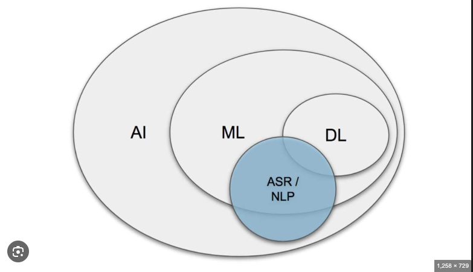
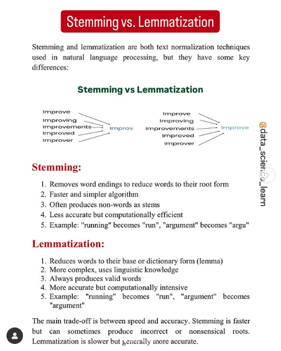

- [Introduction](#introduction)
- [RoadMap to NLP](#roadmap-to-nlp)
  - [Stemming vs Lemmatization](#stemming-vs-lemmatization)

## Introduction
NLP is a field of computer science and a subfield of artificial intelligence that aims to make computers understand human language.

## RoadMap to NLP

1. Text PreProcessing - 1
   1. Tokenization : Breaking sentence to words
   2. StopWords: Filtering out the conjuctions common words like to, in etc
   3. Stemming: Reducing words to their base words
   4. Lemmatization: Reduce words to their base meaningful words
   
### Stemming vs Lemmatization

2. Text PreProcessing - 2
   1. Bag of words (BOW)
   2. TF-IDF
   3. Unigram
   4. Bigrams

3. Text PreProcessing - 3
   1. Word2Vec
   2. AvgWord2Vec

4. Deep Learning
   1. RNN, LSTM RNN, GRU RNN
   2. Text Preparing - Word Embedding
   3. Bi Directional LSTM, Encoders, Decoders, Attention Model
   4. Transformers
   5. Bert

5. Library
   1. NLTP, SPACY, TextBlob (Machine Learning)
   2. Tensorflow, Pytorch
   3. HuggingFace

